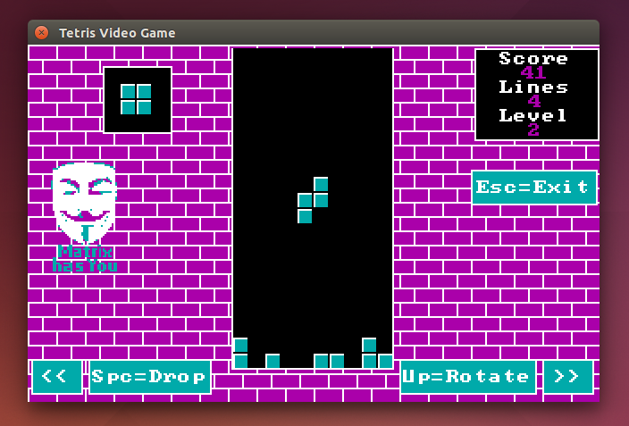

# Tetris Video Game in CGA-style graphics

This is a example for JCGA framework - Tetris Video Game.

## Build

You need download JCGA framework and install it to local maven repository:

    $ git clone https://github.com/vaclav2016/JCGA
    $ cd JCGA
    $ mvn install
    $ cd ..

At second step, You need run Maven to build:

    $ git clone https://github.com/vaclav2016/JCGA-Tetris
    $ cd JCGA-Tetris
    $ mvn install

## Run

    $ cd JCGA-Tetris
    $ java -jar target/cga-tetris-0.0.1-jar-with-dependencies.jar

## Licensing

Code is licensed under the Boost License, Version 1.0. See each
repository's licensing information for details and exceptions.

http://www.boost.org/LICENSE_1_0.txt
